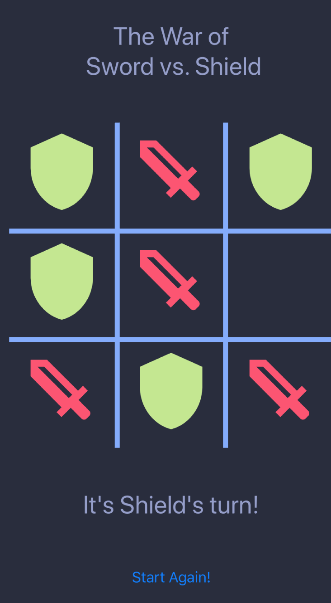

# Simple Tic Tac Toe

###Features

- Allow 2 players to play tic tac toe (Follow the rules of tic tac toe)
- Have 3x3 grid on which the players can play
- Allow the players to take turns marking spaces on the 3x3 grid
- Recognize when a player has won and declare that player as victorious
- Allow the user to start a new game
- As is often the case, the given specification is a little ambiguous in regards to some details about the game and the UI. Feel free to add constraints as you see fit in order to clarify the specification and limit the problem scope to something appropriate for your allotted time.

---

###Assumptions

- Tic Tac Toe is usually 3x3 but players might feel 3x3 is too easy and request for 5x5 grid in the future. Who knows?
  So I created a stateless GameBoard react component that generates the UI for the game board. There is a LENGTH constant inside App.js file and it's set to 3 as a default. If you want to play 5x5, you can simply change that value to 5. You would need to adjust css style for the widths and heights of the icon size and board cell size when you change the LENGTH. I always try to make the code modular as possible so that it's easy to maintain and make it scalable.

- **Checking if the current move is a winning move in the board in the checkWin method.**
  Again, if the board gets bigger than 3x3, it may be inefficient to check all rows and columns and diagonals to see if a player won. This is n^2 time complexity because they have to check all cells in the board. Instead, I used a 1D row array that keeps a sum of each row as an element, a 1D column array that keeps a sum of each column as an element, a diagonal variable that keeps the sum of diagonal values and antiDiagonal variable that keeps the sum of anti-diagonal values.
  This takes O(1) instead since we will be only checking the row array element of the row the player just placed their icon, the column array element of the column the player just placed their icon, the diagonal value and the anti-diagonal value.

- Since there was no requirements about tieing situation, I didn't notify the players when there is a tie. It's very obvious to the players when they see a tie when the board is full or even when the board is not full, there is a case they would know they're tied. So I just made a button that can initialize the game and clear up the board, leaving this up to the players.

- When a player puts their icon on a cell, then that cell should not be touchable. I manuplated disable attribute of TouchableOpacity component to make it untouchable once icon is put.

- I have played Tic Tac Toe before and sometimes we forget who's turn it is. To satisfy this player's need, we show who's turn it is at the bottom.

- I have played Tic Tac Toe before and sometimes players might not know why they've won or lost. It's better if we provide the situation of the board when they actually win so that they would understand.
  I cleared the game board as a callback from alert button so that users can check the board situation when they win and press ok button of the alert to clear up the board.

